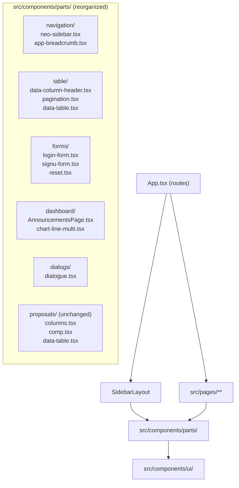

# Design Document: Component Structure Refactor

## Overview

This refactor addresses accumulated structural debt in the React/TypeScript codebase. The goals are:

1. Extract inline sub-components from page files into standalone files
2. Merge known duplicate components into single canonical files
3. Delete confirmed dead files
4. Reorganize `src/components/parts/` into logical subdirectories

No user-visible behavior changes. The TypeScript compiler must report zero errors throughout.

---

## Architecture

The refactor is purely structural — no new runtime logic is introduced. The dependency graph after the refactor will be cleaner:



The refactor proceeds in five sequential phases, each verified by `tsc --noEmit` before moving to the next.

---

## Components and Interfaces

### Phase 1: Inline Component Audit

Inline components identified in `src/pages/`:

| File | Inline Component | Usage Scope |
|------|-----------------|-------------|
| `src/pages/Profile.tsx` | `Detail` | Profile.tsx only |
| `src/pages/Profile.tsx` | `EditAccountForm` | Profile.tsx only |
| `src/pages/Profile.tsx` | `AvatarUpload` | Profile.tsx only |
| `src/pages/Profile.tsx` | `ChangePasswordForm` | Profile.tsx only — **note:** a near-duplicate `ChangePasswordForm` also exists in `src/components/parts/signu-form.tsx` |
| `src/pages/researcher/Dashboard.tsx` | `AnnouncementsPage` (default export) | Shared with staff/Dashboard.tsx |
| `src/pages/staff/Dashboard.tsx` | `AnnouncementsPage` (default export) | Shared with researcher/Dashboard.tsx |

The `Profile.tsx` inline components (`Detail`, `EditAccountForm`, `AvatarUpload`, `ChangePasswordForm`) are used only within that file. They are candidates for extraction but are lower priority than the cross-file duplicates. The `ChangePasswordForm` in `signu-form.tsx` should be evaluated for consolidation with the one in `Profile.tsx`.

### Phase 2: Duplicate Component Inventory

| Duplicate Pair | Canonical | Non-Canonical (delete) | Difference |
|---|---|---|---|
| `data-col-headr.tsx` vs `data-column-header.tsx` | `data-column-header.tsx` | `data-col-headr.tsx` | Byte-for-byte identical |
| `researcher/Dashboard.tsx` vs `staff/Dashboard.tsx` | Extract to `dashboard/AnnouncementsPage.tsx` | Both become thin wrappers | Stats query logic differs (see below) |
| `app-sidebar.tsx` vs `neo-sidebar.tsx` | `neo-sidebar.tsx` | `app-sidebar.tsx` | app-sidebar uses static DATA; neo-sidebar is role-aware with auth |
| `app-breadcrumb.tsx` vs `breadcrumbs.tsx` | `app-breadcrumb.tsx` | `breadcrumbs.tsx` (delete — zero active imports) | Different APIs: auto-URL vs explicit props |

**Dashboard merge strategy** — the only meaningful difference between the two Dashboard files is in `loadStatsAndChart`:

- `researcher/Dashboard.tsx`: queries `proposals` for total/pending/completed counts directly
- `staff/Dashboard.tsx`: queries `proposals` for total, `final_reports` for completed, derives pending as `total - completed`

The shared `AnnouncementsPage` component will accept a `statsLoader` prop:

```typescript
// src/components/parts/dashboard/AnnouncementsPage.tsx

export interface DashboardStats {
  total: number;
  pending: number;
  completed: number;
}

export type StatsLoader = () => Promise<DashboardStats>;

export interface AnnouncementsPageProps {
  user: any;
  profile: Profile;
  statsLoader: StatsLoader;
}

export default function AnnouncementsPage({ user, profile, statsLoader }: AnnouncementsPageProps) {
  // ... shared implementation, calls statsLoader() instead of inline query
}
```

Each role-specific page becomes a thin wrapper:

```typescript
// src/pages/researcher/Dashboard.tsx
import AnnouncementsPage, { type StatsLoader } from '@/components/parts/dashboard/AnnouncementsPage';

const researcherStatsLoader: StatsLoader = async () => {
  const totalQ = supabase.from('proposals').select('proposal_id', { count: 'exact', head: true });
  const pendingQ = supabase.from('proposals').select('proposal_id', { count: 'exact', head: true }).eq('status', 'pending');
  const completedQ = supabase.from('proposals').select('proposal_id', { count: 'exact', head: true }).eq('status', 'completed');
  const [totalR, pendingR, completedR] = await Promise.all([totalQ, pendingQ, completedQ]);
  return { total: totalR.count ?? 0, pending: pendingR.count ?? 0, completed: completedR.count ?? 0 };
};

export default function RDashboard({ user, profile }: { user: any; profile: any }) {
  return <AnnouncementsPage user={user} profile={profile} statsLoader={researcherStatsLoader} />;
}
```

### Phase 3: Dead Component Candidates

| File | Import References | Route in App.tsx | Decision |
|------|-----------------|-----------------|----------|
| `src/pages/Testa.tsx` | App.tsx only (route `/sdevi/sub1`) | Yes — but route is a test stub | Delete + remove route |
| `src/pages/Testb.tsx` | App.tsx only (route `/sdevi/sub2`) | Yes — but route is a test stub | Delete + remove route |
| `src/pages/Test.tsx` | None | No | Delete |
| `src/pages/researcher/FormsTemplates copy.tsx` | None | No | Delete |
| `src/components/parts/app-sidebar.tsx` | `src/app/Layout.tsx` only | No | Delete after verifying Layout.tsx is itself unused |
| `src/pages/researcher/FormsTemplates.tsx` | None (all code commented out) | No | Delete |

**Note on `app-sidebar.tsx`**: It is imported by `src/app/Layout.tsx`. However, `Layout.tsx` is not imported anywhere in the active codebase — `App.tsx` uses its own inline `SidebarLayout` component. Both `app/Layout.tsx` and `app-sidebar.tsx` are effectively dead. Both should be deleted.

**Note on Testa/Testb**: These are registered routes (`/sdevi/sub1`, `/sdevi/sub2`) in `App.tsx`. Deleting them requires also removing those route entries from `App.tsx` and the corresponding imports.

### Phase 4: Parts Directory Reorganization

Target structure after reorganization:

```
src/components/parts/
├── navigation/
│   ├── neo-sidebar.tsx          (was: parts/neo-sidebar.tsx)
│   └── app-breadcrumb.tsx       (was: parts/app-breadcrumb.tsx)
├── table/
│   ├── data-column-header.tsx   (was: parts/data-column-header.tsx)
│   ├── pagination.tsx           (was: parts/pagination.tsx)
│   └── data-table.tsx           (moved from parts/proposals/data-table.tsx — only if it's generic)
├── forms/
│   ├── login-form.tsx           (was: parts/login-form.tsx)
│   ├── signu-form.tsx           (was: parts/signu-form.tsx)
│   └── reset.tsx                (was: parts/reset.tsx)
├── dashboard/
│   ├── AnnouncementsPage.tsx    (new — extracted from researcher/Dashboard.tsx + staff/Dashboard.tsx)
│   └── chart-line-multi.tsx     (was: parts/chart-line-multi.tsx)
├── dialogs/
│   └── dialogue.tsx             (was: parts/dialogue.tsx)
└── proposals/                   (unchanged)
    ├── columns.tsx
    ├── comp.tsx
    └── data-table.tsx
```

**Note on `proposals/data-table.tsx`**: This is a proposals-specific data table, not a generic one. It stays in `proposals/` per requirement 6.5.

All import paths across the codebase must be updated to reflect the new locations. The exported symbol names do not change.

---

## Data Models

### StatsLoader Interface (new)

```typescript
export interface DashboardStats {
  total: number;
  pending: number;
  completed: number;
}

export type StatsLoader = () => Promise<DashboardStats>;
```

### AnnouncementsPageProps (unified)

```typescript
type Profile = {
  fname: string;
  lname: string;
  email: string;
  org: string;
  avatar: string;
  role: string;
} | null;

export interface AnnouncementsPageProps {
  user: any;           // Supabase User — preserved from originals which used `any`
  profile: Profile;
  statsLoader: StatsLoader;
}
```

### DataTableColumnHeaderProps (unchanged, single canonical location)

```typescript
interface DataTableColumnHeaderProps<TData, TValue>
  extends React.HTMLAttributes<HTMLDivElement> {
  column: Column<TData, TValue>;
  title: string;
}
```

---

## Correctness Properties

*A property is a characteristic or behavior that should hold true across all valid executions of a system — essentially, a formal statement about what the system should do. Properties serve as the bridge between human-readable specifications and machine-verifiable correctness guarantees.*

### Property 1: No stale import paths remain

*For any* TypeScript/TSX file in `src/`, no `import` statement should reference a file path that no longer exists (deleted files or files at their old pre-reorganization paths).

**Validates: Requirements 4.6, 6.2**

### Property 2: Exported component symbols are preserved

*For any* component that was extracted, merged, or moved, the set of named exports and the presence/absence of a default export in the canonical file must be identical to the original file.

**Validates: Requirements 7.4, 7.5**

### Property 3: Props interfaces are preserved through extraction and merge

*For any* component that was extracted from a page file or merged from a duplicate, the exported props interface (or type alias) in the new canonical file must be structurally equivalent to the original — same property names, same types, no widening.

**Validates: Requirements 2.5, 7.3, 8.3**

### Property 4: All App.tsx routes resolve to existing components

*For any* route defined in `App.tsx`, the component it references must exist at the imported path and export the expected symbol (default or named).

**Validates: Requirements 7.1**

### Property 5: No new `any` types introduced

*For any* newly created or modified component file, the count of `any` type annotations must not exceed the count present in the original file at the same locations.

**Validates: Requirements 8.1**

### Property 6: Moved components exist at their new paths with unchanged export names

*For any* component moved to a subdirectory during reorganization, the file must exist at the new path and the exported component symbol name must be identical to what it was before the move.

**Validates: Requirements 6.1, 6.3**

### Property 7: TypeScript compiler reports zero errors

*For any* state of the codebase after each refactor phase, running `tsc --noEmit` must exit with code 0.

**Validates: Requirements 2.4, 4.7, 5.4, 6.4, 7.2, 8.4**

---

## Error Handling

**Import path breakage**: The primary risk is updating import paths incorrectly. Mitigation: run `tsc --noEmit` after each phase. TypeScript will surface any broken imports as errors.

**Partial Dashboard extraction**: If `statsLoader` is not passed to `AnnouncementsPage`, the component will fail at runtime. Mitigation: make `statsLoader` a required prop (no default) so TypeScript enforces it at compile time.

**Dead file with active transitive imports**: `app-sidebar.tsx` is imported by `src/app/Layout.tsx`. Before deleting `app-sidebar.tsx`, confirm `Layout.tsx` itself has no active importers. The grep confirms it does not — `App.tsx` uses its own `SidebarLayout` inline component.

**Testa/Testb route removal**: Removing these routes from `App.tsx` is safe since they are test stubs with no navigation links pointing to them in the active UI. Verify with a grep for `/sdevi/sub1` and `/sdevi/sub2` in non-App.tsx files before deletion.

---

## Testing Strategy

### Unit Tests

Focus on specific examples and integration points:

- Verify `AnnouncementsPage` renders correctly when given a mock `statsLoader` that resolves immediately
- Verify `AnnouncementsPage` renders the loading skeleton when `statsLoader` is pending
- Verify `DataTableColumnHeader` renders sort controls when `column.getCanSort()` is true
- Verify `DataTableColumnHeader` renders plain text when `column.getCanSort()` is false
- Verify `AppBreadcrumb` renders the correct breadcrumb items for a given URL path
- Verify `LoginForm` calls `supabase.auth.signInWithPassword` with the correct credentials on submit

### Property-Based Tests

Use [fast-check](https://github.com/dubzzz/fast-check) (TypeScript-native PBT library). Each test runs a minimum of 100 iterations.

**Property 1: No stale import paths**
```
// Feature: component-structure-refactor, Property 1: No stale import paths remain
// For any file in src/, parse its import statements and verify each referenced path exists on disk
```
Implementation: generate the set of all `.ts`/`.tsx` files, parse their imports, assert each resolved path exists. This is a static analysis property run as a test.

**Property 2: Exported symbols preserved**
```
// Feature: component-structure-refactor, Property 2: Exported component symbols are preserved
// For any canonical component file, its exports match the pre-refactor snapshot
```
Implementation: snapshot the export names of each component before the refactor; after, assert the snapshots match.

**Property 3: Props interfaces preserved**
```
// Feature: component-structure-refactor, Property 3: Props interfaces are preserved through extraction and merge
// For any extracted/merged component, its props type is structurally equivalent to the original
```
Implementation: TypeScript structural type checking enforces this at compile time. The property test verifies `tsc --noEmit` exits 0 after each phase.

**Property 4: All routes resolve**
```
// Feature: component-structure-refactor, Property 4: All App.tsx routes resolve to existing components
// For any route in App.tsx, the imported component file exists and exports the expected symbol
```
Implementation: parse `App.tsx` imports, assert each file exists and exports the referenced symbol.

**Property 5: No new `any` types**
```
// Feature: component-structure-refactor, Property 5: No new any types introduced
// For any modified file, any-type count does not exceed original
```
Implementation: use fast-check to generate file paths from the modified set, grep for `any` annotations, compare counts to pre-refactor baseline.

**Property 6: Moved components at new paths**
```
// Feature: component-structure-refactor, Property 6: Moved components exist at new paths with unchanged export names
// For any component in the reorganization map, it exists at its new path and exports the same symbol name
```
Implementation: define the expected path mapping as a record, assert each entry.

**Property 7: TypeScript zero errors**
```
// Feature: component-structure-refactor, Property 7: TypeScript compiler reports zero errors
// tsc --noEmit exits with code 0 after each phase
```
Implementation: shell out to `tsc --noEmit` in the test and assert exit code 0. Run after each phase.

### Test Configuration

- PBT library: `fast-check` (already compatible with Vitest)
- Minimum iterations per property: 100
- Run with: `vitest --run` (single-pass, no watch mode)
- Each property test file should be tagged with the feature and property number in a comment at the top
